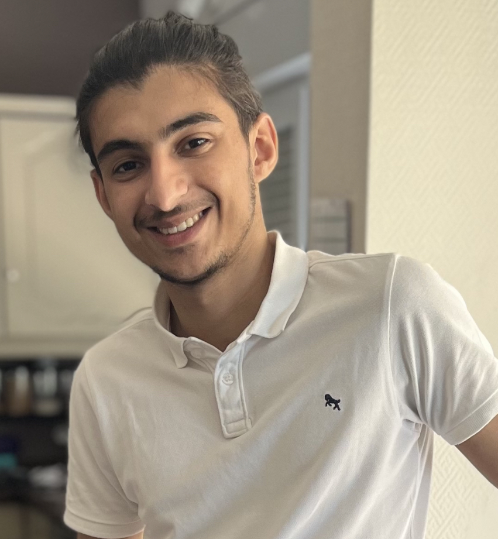

# Ilias HAMDAOUI
*ma citation* 

## description de l'artiste

| Birthday: | 29/01 |
|--|--|
| Favorite color: | Blue |
|--|--|
| Favorite food: | BBQ |
|--|--|
| Pinneaple on pizza: | <input type="checkbox" /> yes <input type="checkbox" /> no <input type="checkbox" /> NO PIZZA |

## Hobbies
 - music
	1. un peu pnl
	2.  un peu angel
	3. un peu piano (quand faut se concentrer) 
 - cinema/Netflix
	 1. Shaolin soccer (le DVD que je mettais en boucle)
	 2. How i meet your mother
	 3. Ozark
 - gaming
	 1. CS
	 2. CS
	 3. CS

## You can always count on me when...

_Tell your teammates which positive contribution to the group you will make._  
_This could be technical, making people feel comfortable, being an organiser..._

## A funny story
once upon a time... Ilias jumps in his dad's taxi and found a 50$ bill on the backseat we can say it was his lucky lucky day... or not.
Once back at home he was playing with small magnet in his parents room.
A pile of magnets in his hand, at war in his imagination.
 -GRENAADE
 *SUDDEN HAND GESTURE*
 BOOM
 The wardrobe door finished in a crumb
 The 50$ has been used for a new door (not even the good reference the wardrobe is still empty of door at this day)
### TL,DR
I'm still broke

[Corentin](https://github.com/corentinnys/markdown-challenge) | Illias | [Jason](https://github.com/J0K3RY-03/markdown-challenge)
